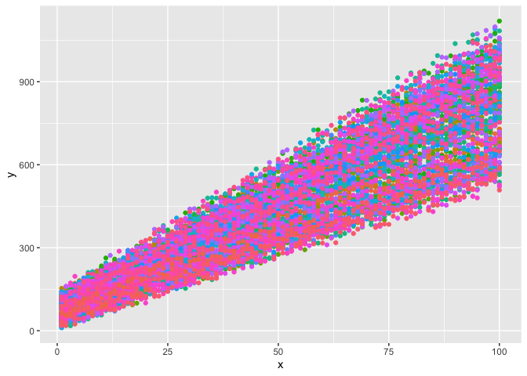
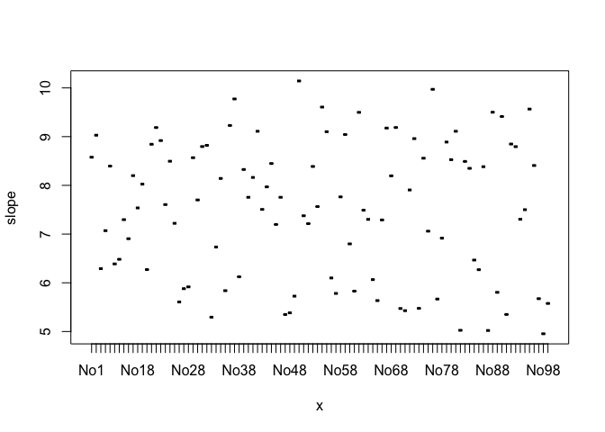

Linear-Data-Fit
================
Thomas Gredig
5/21/2020

# Linear Data Fit

The data is generated with [make-fit-data.R](make-fit-data.R). Load the
data with

``` r
library(ggplot2)
d = read.csv('data/fit-data.csv')
ggplot(d, aes(x,y, col=name)) + 
  geom_point() + 
  theme(legend.position = 'none')
```

<!-- -->

# Fit the Data

Here is the R version with a for loop, not optimized for speed, but
intuitive for most programmers:

``` r
r = data.frame()
for(nm in levels(d$name)) {
  lm(data= subset(d, name == nm),
     y~x) -> fit
  r = rbind(r, data.frame(name = nm, slope = summary(fit)$coeff[2]))
}
plot(r$name, r$slope, ylab='slope')
```

<!-- -->
