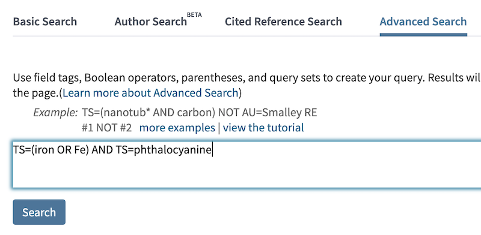
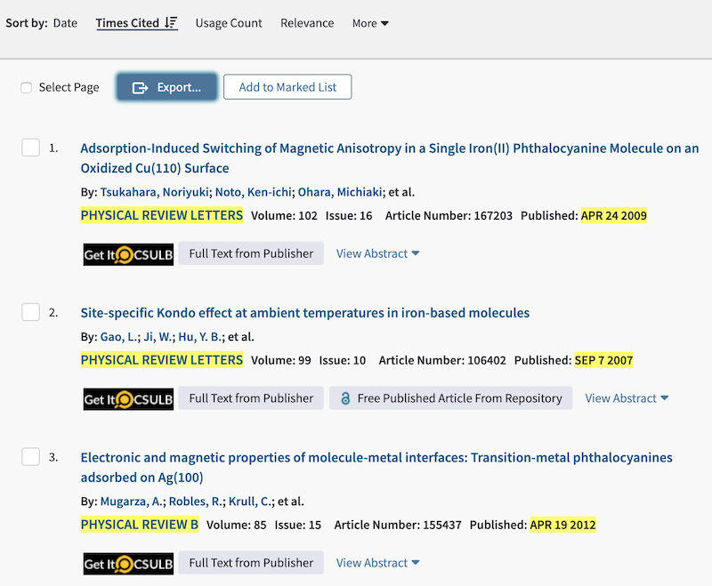
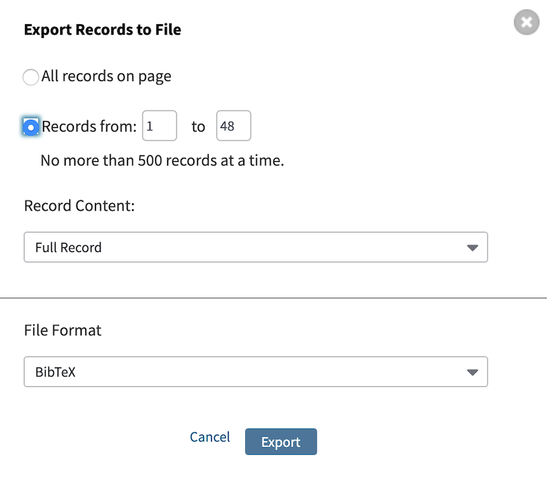
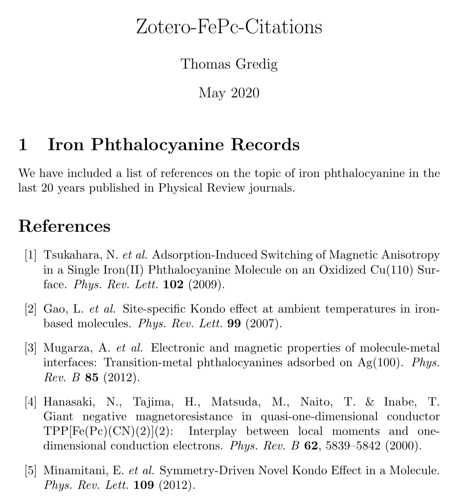

Zotero-Citations
================
Thomas Gredig
5/21/2020

## Zotero Citations

The task is to cite all work published in *Physical Review* on the topic
of iron phthalocyanine in the last 20 years.

In order to do this quickly, we will use 2 tools,
[Zotero](https://www.zotero.org/) and [LaTeX on
OverLeaf](https://www.overleaf.com/)

1.  Install [Zotero](https://www.zotero.org/)
2.  Install Better BibTeX, see [Gredig M.S.
    Guidelines](https://github.com/thomasgredig/MSthesis-Guidelines#references)
3.  Create an account on [LaTeX on OverLeaf](https://www.overleaf.com/)
4.  Go to Web of Science through the [CSULB
    Library](https://www.csulb.edu/university-library)
5.  Choose **Advanced Search** on Web of Science search.



6.  Refine the search results by selecting specific **Publication
    Years** and selecting the journal under **Source Titles**

7.  You can sort the titles by **Times Cited**



8.  Choose **Export** and *Other File Formats*
9.  Select all records and the *Full Record* in *BibTeX* format



10. Login to [LaTeX on OverLeaf](https://www.overleaf.com/)
11. Select *New Project* and choose **Example Project**
12. Click on the *Upload Icon* (up arrow next to folder below Menu) and
    select the `savedrecs.bib` file that you exported
13. Remove the text and figure after introduction and replace with your
    own text
14. Add the `\nocite{*}` command to include all uncited references from
    the bibliography file.

<!-- end list -->

``` latex
\nocite{*}
\bibliographystyle{plain}
\bibliography{savedrecs}
```

15. Choose a [BibTeX
    style](https://www.overleaf.com/learn/latex/Questions/Which_BibTeX_Styles_are_Available_on_Overleaf%3F),
    such as `naturemag` that also includes the title in the reference.

The full listing may look as follows:

``` latex
\documentclass{article}
\usepackage[utf8]{inputenc}

\title{Zotero-FePc-Citations}
\author{Thomas Gredig}
\date{May 2020}
\bibliographystyle{naturemag}

\begin{document}

\maketitle

\section{Iron Phthalocyanine Records}

We have included a list of references on the topic of iron phthalocyanine in the last 20 years published in Physical Review journals.

\nocite{*}


\bibliography{savedrecs}
\end{document}
```

16. Download the PDF file with all the references.’

17. You may rename the journal using the `@STRING` command in the
    `*.bib` file

<!-- end list -->

``` latex
@string{prl="Phys. Rev. Lett."}
@string{prb="Phys. Rev. B"}
```

The final PDF file may start as shown here:


